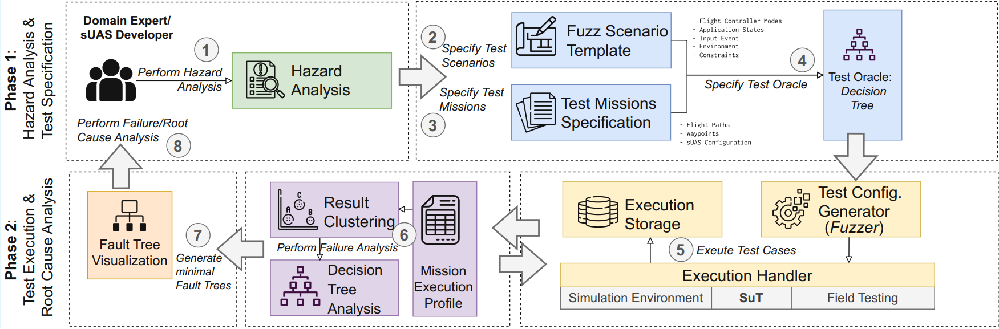

# Supplemental Material "Behavioral Fuzzing for Mode Transitions and Failsafes in sUAS"

_submitted to the 48th International Conference on Software Engineering (ICSE) 2026, Technical Track_

  

## Overview

SAFUS is an automated fuzz testing pipeline designed to validate the autonomous behavior of small Uncrewed Aerial Systems (sUAS). By targeting mode transitions and failsafe mechanisms in layered sUAS state machines, SAFUS exposes subtle failures with fuzzing that may arise due to environmental disturbances, timing variability, and human interaction.

This framework enhances safety assurance by systematically generating fuzz scenarios, executing tests in simulation, and producing fault trees to aid root cause analysis. 

---

## Features

- **Layered state machine analysis** covering application-level logic and varied autopilot firmware (PX4, ArduPilot).  
- **Semantic fuzzing pipeline** injecting realistic environmental and timing disturbances.  
- **Automated generation** of test scenarios from hazard analysis.  
- **Decision-tree based labeling** to classify test outcomes (success, failure, invalid).  
- **Fault tree visualization** for root cause analysis.
- **Support for simulation-based and real-world testing** of sUAS.  

---

## Motivation

sUAS operate in unpredictable environments and rely on complex state machines for safe and reliable behavior. Existing testing approaches often focus on low-level input mutations or specific functionalities but lack systematic validation of state transitions and failsafe activations under realistic conditions.

SAFUS addresses this challenge by enabling behaviorally meaningful fuzz testing to detect critical faults early in development.

---

## Architecture

The SAFUS pipeline consists of 8 main phases:

*Figure: High-level SAFUS pipeline architecture.*

## Validation

To evaluate the effectiveness of SAFUS we used a multi-sUAS application (real name withheld for DB-Review Process - We will provide a link to the SuT and further details upon acceptance of the paper).

We evaluate the effectiveness, scalability, and practical utility of SAFUS through three research questions, each accompanied by corresponding supplemental artifacts:

| Research Question | Description | Artifact |
|-------------------|-------------|----------|
| **RQ1: Test Oracle Automation** | _To what extent can test oracle functionality be automated for autonomous sUAS fuzz testing in a real-world system?_    This examines whether our framework, particularly its use of a Decision Tree, can effectively categorize complex flight outcomes and accurately detect failure cases while filtering out correct behaviors. | [Test Scenarios](RQ1.md#scenarios), [Decision Tree](RQ1.md#decision-tree) |
| **RQ2: Detection of Transition Errors** | _To what extent can SAFUS detect mode and state-related transition errors in an SuT?_    This investigates SAFUS's capability to identify failures in a real-world sUAS system. | [Detected Failures](RQ2.md#failures), [Fault Trees](RQ2.md#fault-trees) |
| **RQ3: Real-World Reproducibility** | _To what extent are the failures identified by SAFUS in simulation reproducible in real-world flight tests?_    This assesses the correspondence between simulation-detected failures and their manifestation in physical flight, examining consistency for both unresolved faults and those marked as mitigated. | [Flight Logs](RQ2.md#fault-trees) |

These artifacts are provided as supplemental material to support the validation of SAFUS.

> **Code Examples Notice:**  
> We have included some code examples to demonstrate parts of our automated pipeline. We have left other major files tied to our onboard pilot (to preserve anonymity), and the code base is not directly executable since we use a custom Docker interface and other functions to interface with our SuT (more details to come if accepted).

