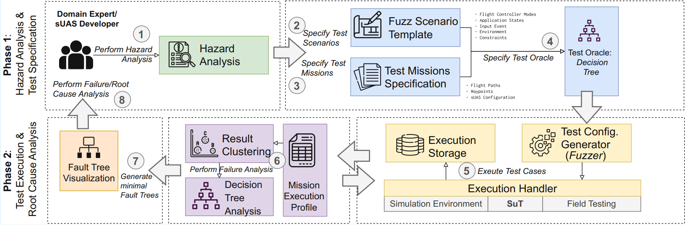

# Supplemental Material "Uncovering Failures in Cyber-Physical System State Transitions: A Fuzzing-Based Approach Applied to sUAS"

Theodore Chambers, Arturo Miguel Russell Bernal, Michael Vierhauser, Jane Cleland-Huang

_accepted at the 48th International Conference on Software Engineering (ICSE) 2026, Technical Track_

<br><br>


__Citation:__
```
@inproceedings{statefuzz_icse26,
title = {Uncovering Failures in Cyber-Physical System State Transitions: A Fuzzing-Based Approach Applied to sUAS},
 author = {Chambers, Theodore and Bernal, Arturo Miguel Russell and Vierhauser, Michael and Cleland-Huang, Jane},
 booktitle = {Proceedings of the 48th International Conference on Software Engineering},
 doi = {N/A},
 publisher = {Association for Computing Machinery},
 series = {ICSE 2026},
 year = {2026}
}
````


<br><br>


## Overview

_SaFUZZ_ is an automated fuzz testing pipeline designed to validate the autonomous behavior of small Uncrewed Aerial Systems (sUAS). By targeting mode transitions and failsafe mechanisms in layered sUAS state machines, _SaFUZZ_ exposes subtle failures with fuzzing that may arise due to environmental disturbances, timing variability, and RC Input.

This framework enhances software system safety assurance by systematically generating fuzz specifications, executing tests in simulation, and producing fault trees to aid root cause analysis. 

---

## Features

- **Automated generation** of test scenarios from hazard analysis.  
- **Layered state machine analysis** covering application-level logic and varied autopilot firmware (PX4, ArduPilot).  
- **Fuzzing pipeline** injecting realistic environmental and timing disturbances along with RC Inputs.  
- **Decision-tree based labeling** to classify test outcomes (success, failure, invalid).  
- **Fault tree visualization** for root cause analysis.
- **Support for simulation-based and real-world testing** of sUAS.  

---

## Motivation

sUAS operate in unpredictable environments and rely on complex state machines for safe and reliable behavior. Existing testing approaches often focus on low-level input mutations or specific functionalities but lack systematic validation of state transitions and failsafe activations under realistic conditions that can be extended to the real world.

_SaFUZZ_ addresses this challenge by enabling behaviorally meaningful fuzz testing to aid detection of potential faults early in development.

---

## Architecture

The _SaFUZZ_ pipeline consists of 8 main phases:


*Figure: High-level _SaFUZZ_ pipeline architecture.*


## Validation


To evaluate the effectiveness of _SaFUZZ_ we used a multi-sUAS application (real name withheld for DB-Review Process - We will provide a link to the SuT and further details upon acceptance of the paper).


We evaluate the effectiveness, scalability, and practical utility of _SaFUZZ_ through three research questions, each accompanied by corresponding supplemental artifacts:

| Research Question | Description | Artifact |
|-------------------|-------------|----------|
| **RQ1: Failure Detection** | _To what extent can _SaFUZZ_ identify previously unknown behavioral failures in a real-world sUAS system?_ <br><br> This question examines whether our framework can effectively detect and categorize failures in the SuT. For each type of failure, we identify potential actions such as code modifications, requirements analysis, or updates to the decision tree.| [Test Scenarios](RQ1.md#scenarios), [Decision Tree](RQ1.md#decision-tree) |
| **RQ2: Detection of Transition Errors** | _How well do the transition-related errors detected by _SaFUZZ_ align with those identified by the development team over time?_ <br><br> We conduct a detailed analysis of mode and state-related transition errors that were identified by the Drone Response development team within a time frame of 18 months, between January 2024 and July 2025, and whether _SaFUZZ_ also identified them. | [Detected Failures](RQ2.md#failures), [Fault Trees](RQ2.md#fault-trees) |
| **RQ3: Real-World Reproducibility** | _To what extent are the failures identified by _SaFUZZ_ in simulation reproducible in real-world flight tests?_ <br><br> This assesses the correspondence between simulation-detected failures and their manifestation in physical flight, examining consistency for both unresolved faults and those marked as mitigated. | [Flight Logs](RQ2.md#fault-trees) |

These artifacts are provided as supplemental material to support the validation of _SaFUZZ_.

> **Code Samples Notice:**  
> We have included some code samples to demonstrate parts of our automated pipeline. You can browse them in the [CodeSamples directory](./CodeSamples/). The code base is not directly executable since we use a custom Docker interface and other functions to interface with our SuT.


