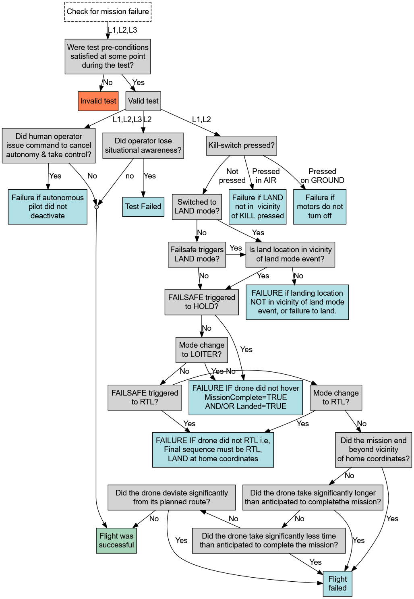

## RQ1: To what extent can test oracle functionality be automated for autonomous sUAS fuzz testing in a real-world system?

We used the following three Fuzz Scenario Templates to automate the test oracle functionality for autonomous sUAS fuzz testing:

## Fuzz Scenario Templates

| **Fuzz Scenario** | **FSC-1** | **FSC-2** | **FSC-3** |
|-------------------|-----------|-----------|-----------|
| **Overview** | Test human control across multiple states | Test Failsafe actions across two states | Test Failsafe actions triggered by geofence |
| **JSON Specification** | [FSC1.json](Listings/FSC1.json) | [FSC2.json](Listings/FSC2.json) | [FSC3.json](Listings/FSC3.json) |
| **PX4 Modes** | `OFFBOARD`, `LAND` | `OFFBOARD` | `OFFBOARD` |
| **Tested App States** | `TAKEOFF`, `FLYING_TO_WAYPOINT`, `HOVERING`, `LANDING`, `DISARMING` | `FLYING_TO_WAYPOINT`, `HOVERING` | `FLYING_TO_WAYPOINT` |
| **Tested Mode activations** | *RC_INPUT:* `ALTCTL`, `POSCTL`, `STABILIZED` | *RC_INPUT:* `AUTO.LOITER`, `AUTO.LAND`, `AUTO.RTL` | *GEOFENCE ACTIONS:* RTL (+LAND), LAND, WARNING *RC_INPUT_EVENTS:* `ALTCTL`, `POSCTL`, `STABILIZED` |
| **Environment / Context** | - *Delay:* short (50–200), medium (200–600), long (600–1200) ms - *Throttle:* mid - *Geofence:* none - *Wind, GPS, Compass:* none - *Context:* Flight plan A - *Constraints:* PX4 mode -- App state mapping | - *Delay:* short / medium - *Throttle:* mid - *Geofence:* none - *Wind, GPS, Compass:* none &#124; low / medium / high &#124; low / medium / high - *Context:* Flight plan B | - *Delay:* short / medium / long - *Throttle:* mid - *Geofence:* active &#124; actions: `WARN`, `RETURN`, `TERMINATE` - *Wind, GPS, Compass:* none - *Context:* Flight plan C |
| **Failures** |  |  |  |

   

### Fuzz Scenario Template Description

The following provices an overview of the elements used in the Fuzz Scenario Templates:

| **Field** | **Description** | **Example Values** |
|-----------|-----------------|--------------------|
| `FROM_PX4_modes` | List of PX4 flight modes that the system begins in | `"OFFBOARD"`, `"LAND"` |
| `FROM_APP_states` | List of application-level states to fuzz transitions from | `"TAKEOFF"`, `"HOVERING"` |
| `RC_INPUT_EVENTS` | Manual input modes injected during the test | `"ALTCTL"`, `"POSCTL"` |
| `ENVIRONMENT.transition_delay` | Time interval between state and input event | `50-1200 ms` |
| `ENVIRONMENT.throttle` | Throttle stick position during transition | `"mid"`, `"high"`, `"low"` |
| `ENVIRONMENT.geofence` | Geofence status during test | `"none"`, `"triggered"` |
| `ENVIRONMENT.wind` | Wind conditions applied during test | `"none"`, `"gusty"` |
| `ENVIRONMENT.GPS` | GPS reliability during test | `"none"`, `"degraded"` |
| `ENVIRONMENT.COMPASS_INTERFERENCE` | Magnetic interference level | `"none"`, `"moderate"` |
| `MISSION_CONTEXT` | Flight plan or mission scenario under test | `"Flight plan A"` |
| `CONSTRAINTS.REQUIRES_PX4_MODE` | Specifies required PX4 mode for certain APP states | `"OFFBOARD": ["TAKEOFF", "HOVERING"]` |

   

## Decision Tree for Test Oracle Automation

