## RQ2: To what extent can SAFUS detect mode and state-related transition errors in an SuT?

We identified the following Failures:

## Fuzz Scenario Templates

| **ID** | **Category** | **Description** | **Type** |
|--------|--------------|-----------------|----------|
| F1 | Mode change ignored from multiple states | Land command ignored in `HOVERING` state. | ● |
| F2 | Mode change ignored from multiple states | `TAKEOFF` ignores human control. | ● |
| F3 | Mode Change Command causes thrashing | Thrashing between states. Upon reactivation, `OFFBOARD` uses old setpoint, causing jerky flight. | ● |
| F4 | Delayed Mode Change | `POSCTL` only acknowledged after `RTL` completed | ● |
| F5 | Unclear requirements | Takeoff ignores `RTL` -- treated as missing requirement. `RTL` should be handled as `LAND` during takeoff | ● |
| F6 | Erratic mode changes caused by interference | GPS Noise created interference causing thrashing between `LAND` and `TAKEOFF` modes | ● |
| F7 | Simulation Error | Simulation Error: Expected to succeed in real-world | ◐ |
| F8 | PX4 issue within mode | PX4 Issue: Failure to disarm upon landing in `STABILIZED` mode | ◐ |
| F9 | Missing logic in Decision Tree. Updated to handle `AUTO.LOITER` & throttle toggle correctly in future tests | Decision Tree did not recognize that Throttle toggling triggers a mode change to `POSCTL` | ○ |
| F10 | Missing logic in Decision Tree. Updated to handle `AUTO.LOITER` & throttle toggle correctly in future tests | Decision Tree did not recognize that `AUTO.LOITER` is handled as `POSCTL` in RotorCraft | ○ |
| F11 | Missing logic in Decision Tree. Updated to handle `AUTO.LOITER` & throttle toggle correctly in future tests | Decision Tree did not recognize that `AUTO.LOITER` is handled as `POSCTL` in RotorCraft | ○ |

**Legend:**  
● True positive mode/state related failure  
○ False positive failure  
◐ Valid failure but not directly associated to mode/state transitions

   

## Fault Trees
> **Note:** The full Flight logs from PX4 will attached here if accepted *(removed for anonymity as they potentially reveal location information)*  

| **ID** | **Fault Tree Image** | **Flight Log Example** |
|--------|----------------------|------------------------|
| F1  | 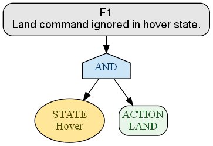  | 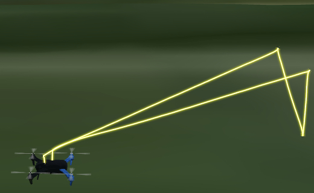  |
| F2  | 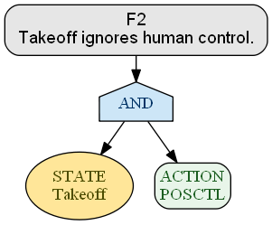  | 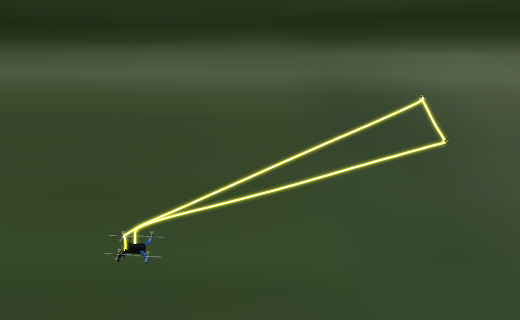  |
| F3  | 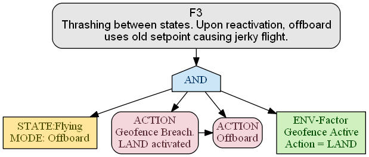  | 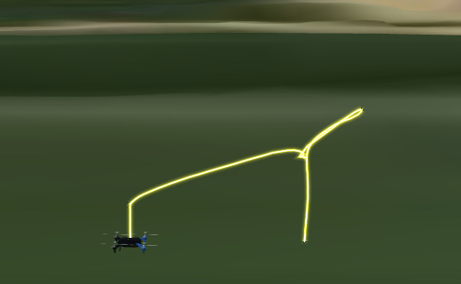  |
| F4  | 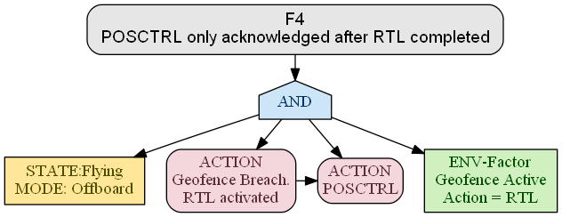  | 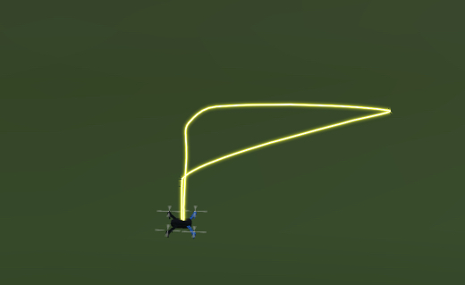  |
| F5  | 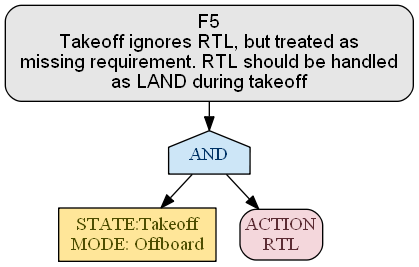  | 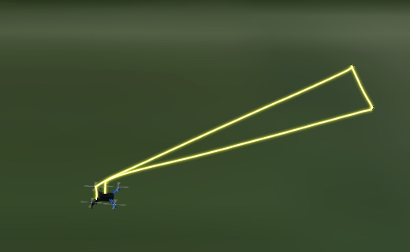  |
| F6  | 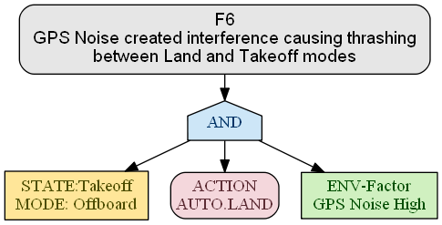  | 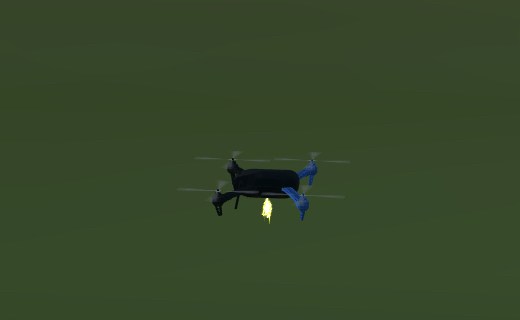  |
| F7  | 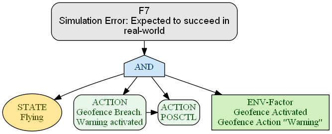  | 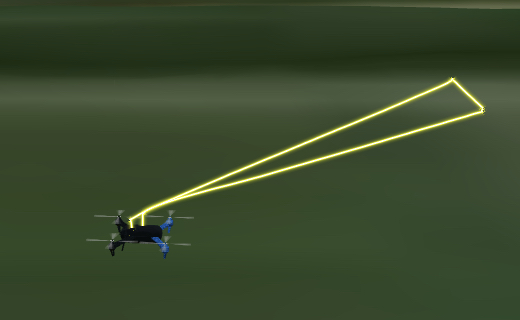  |
| F8  | 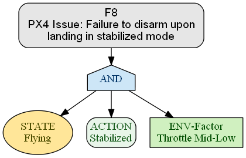  | 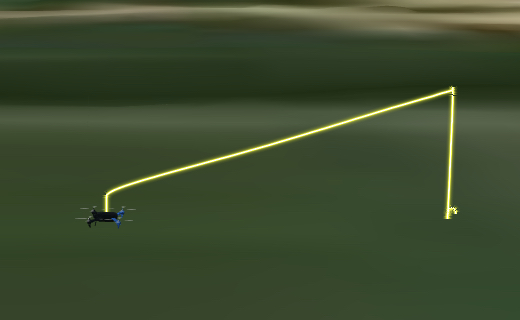  |
| F9  | 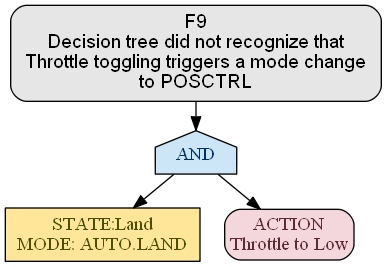  | 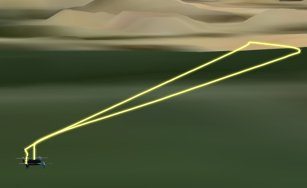  |
| F10 | 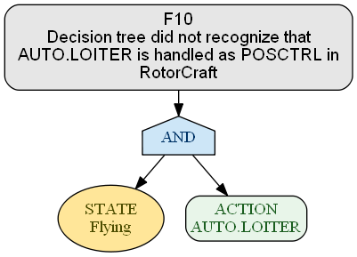 | 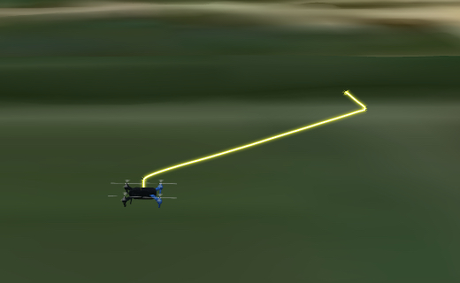 |
| F11 | 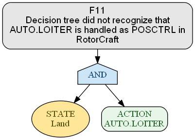 | 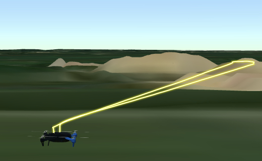 |

## Mission Profiles
We have included all sample Mission Profiles (logged data from the flights) corresponding to F1-F11 in the [MissionProfile/](MissionProfile/) directory.

---

## Pipeline Reduction: From Scenarios to Fault Trees

The chart below shows how we distilled thousands of fuzz tests into a handful of fault trees through clustering and focused test execution.

Below, we walk through a concrete example from the **FSC2** scenario to show how case selection and **Step 7** of the pipeline (additional test execution) work in practice.  
After that, we provide examples of selecting cases from **FSC1**, highlighting how **FSC2** confirmed faults that were first identified in **FSC1**.

## 1 – Case Selection from Clusters

1. **Compute distance to centroid** for each failure in a cluster and select:  
   - **One closest** (most typical failure)  
   - **One furthest** (edge-case behavior)

2. **Remove repeat tests:** if multiple selected failures share the **same mode** and **same app state**, treat them as **one case**.

### Example with Clustered Data from FSC2:

Note: Each test parameter (timing, GPS noise, and compass interference) was discretized into three levels: Low-1, Mid-2, and High-3.

**Cluster 0**  
- `STATE HOVER with RC Input LAND` (timing = 2, gps_noise = 2, compass_interference = 2)  | _closest_  
- `STATE HOVER with RC Input LAND` (timing = 1, gps_noise = 3, compass_interference = 2)  | _furthest_

**Cluster 1**  
- `STATE HOVER with RC Input RTL`  (timing = 1, gps_noise = 3, compass_interference = 2)  | _closest_  
- `STATE HOVER with RC Input RTL`  (timing = 1, gps_noise = 3, compass_interference = 1)  | _furthest_

**Cluster 2**  
- `STATE FLYING with RC Input RTL` (timing = 1, gps_noise = 3, compass_interference = 2)  | _closest_  
- `STATE FLYING with RC Input RTL` (timing = 2, gps_noise = 3, compass_interference = 2)  | _furthest_

**Cluster 3**  
- `STATE HOVER with RC Input LAND`    (timing = 1, gps_noise = 3, compass_interference = 2)  | _closest_  
- `STATE FLYING with RC Input LOITER` (timing = 3, gps_noise = 3, compass_interference = 3)  | _furthest_

**Selected test cases for FSC2:**  
- `HOVER + LAND`  
- `HOVER + RTL`  
- `FLYING + RTL`  
- `FLYING + LOITER`  

_Result: 4 unique cases instead of 8._

## 2 – Testing Around Failure Cases

In **Step** 7, **“Executing additional fuzz tests”**, we test adjacent states around each selected failure along with timing variations to explore and map fault boundaries prior to truth table construction.

### Additional Testing (FSC2 example):

From the case `AUTO.LOITER` during `FLYING` (selected after clustering step), we also tested:  
- `AUTO.LOITER` during **HOVER** (state before)  
- `AUTO.LOITER` during **LAND** (state after)  

Each test revealed a separate fault that was later confirmed to be a decision tree related error, demonstrating how multiple fault trees can be discovered from a single case after the clustering phase.

## Final Fault Tree Mappings for FSC2

- **F10** – directly from the clustered case (`AUTO.LOITER` during FLYING)  
- **F11** – from testing the same case in state **HOVER**  
- **F9**  – from testing around **LAND** transition in case (`AUTO.LAND` during HOVER)
- **F5**  – from testing an adjacent **RTL** transition in case (`RTL` during HOVER)

**Remarks**  
- The `AUTO.LAND` during state **HOVER** test case was originally discovered and mapped in FSC1. Although we re‑verified it in FSC2, we did not add it to the FSC2 as a fault tree because it already exists under FSC1.  
- The `RTL` tests during both **HOVER** and **FLYING** were also first traced back to GPS noise‑frequency errors (F6) in FSC1. For that reason, they remain mapped to FSC1 F6 rather than being remapped to FSC2.

---

Note - Here we provide further details from FSC1 testing -
### Additional Testing (FSC1 example):

We initially identified three clustering‑derived test cases: `STABILIZED` during **TAKEOFF**, `POSCTL` during **TAKEOFF**, and `STABILIZED` during **FLYING**.  
Based on the FSC1 listing which includes PX4 modes `OFFBOARD` and `LAND`, we re‑executed tests to cover all `OFFBOARD` sub‑states and `LAND` transition (including `AUTO.LAND`).  
In doing so, we uncovered a previously missed fault during **HOVER** in `AUTO.LAND`. This fault was later reconfirmed in the FSC2 tests as well.

## Final Fault Tree Mappings for FSC1:

- **F1** – from additional test executing (`LAND` during HOVER). This was repeated in FSC2.
- **F2** – directly from the clustered case  (`POSCTL` during TAKEOFF)   
- **F6**  – from testing around clustered case  (`POSCTL` during TAKEOFF). This was found to be a gps noise induced error repeated in FSC2.
- **F8**  – directly from the clustered case (`STABILIZED` during FLYING)
---

**Remarks**  
- The failure observed in `STABILIZED` mode during **TAKEOFF** was identical to the one in `POSCTL` mode during **TAKEOFF**. Therefore, we represent it once as **F2** (for `POSCTL` during **TAKEOFF**) and omit the `STABILIZED` case.
